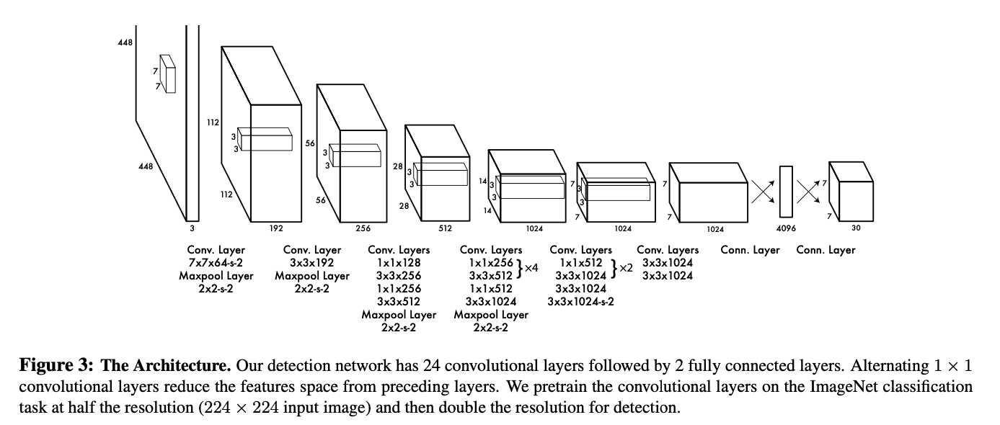

# MSDS-DL-Final-YOLO-Implement
Author: Eriko Funasato, Sicheng Zhou

This is the final project repo of MSDS 631 Deep Learning Neural Networks course taught by Michael Ruddy at University of San Francisco. In this project, we implement the paper [You Only Look Once: Unified, Real-Time Object Detection](https://arxiv.org/pdf/1506.02640.pdf).

- [Project Progress Log](docs/Project-Progress-Log.md)

## Description of Task
We implement the detection network in the original paper, pre-train the convolutional layers on the ImageNet classification task, then add fully connected layer on object detection task using PASCAL VOC 2007 and 2012 Dataset.

Here is the model architecture.

## Training Parameters
- Loss Function: multi-part loss function
- Epochs: 135
- Batch Size: 64
- Momentum: 0.9
- Weight Decay: 0.0005
- Learning Rate: 0.01 for 75 epochs, 0.001 for 30 epochs, and 0.0001 for 30 epochs
- Dropout Rate: 0.5
